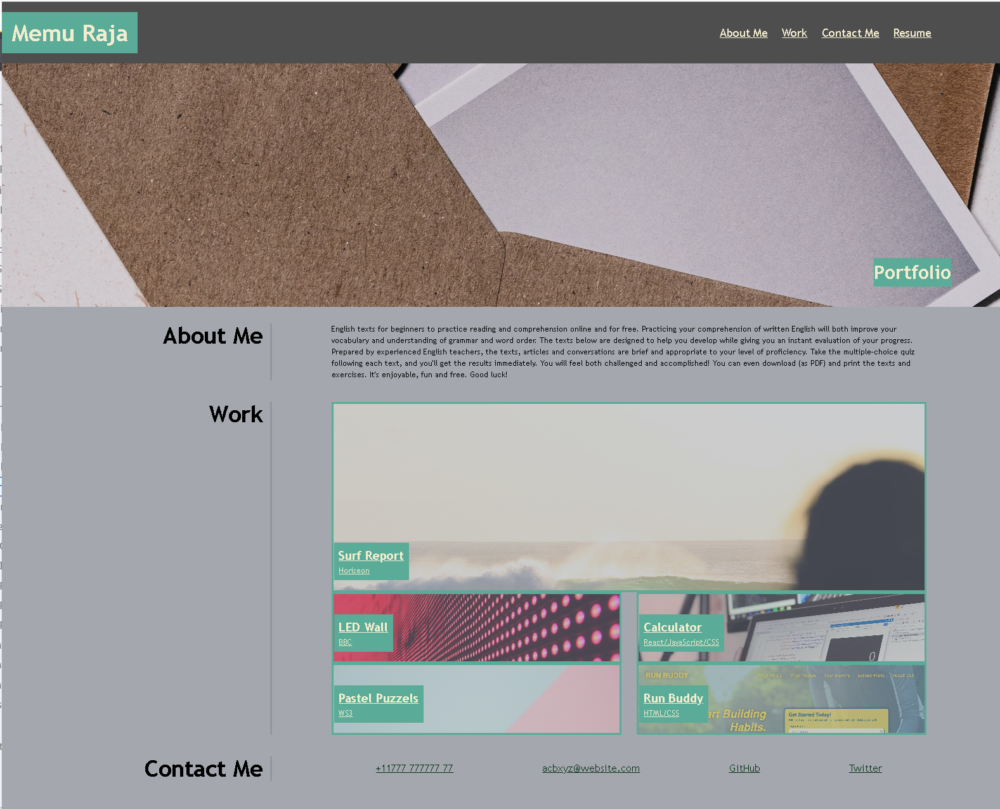

# My portfolio
## Description
This project is to create porfolio web site. Providing contact infrmation, Personal statment and showcasing links to the some of the project work in work history.

## Challenges
Understanding the variables
Flexboxes and grids
Understanding the rem units in font size
Aligning Images
understanding Media query

That how my web paged looked at start

Images were not alligning

Final look

## Things I learned
Instead of using the 'px' can use 'rem','em', 'vh' and 'vw' for more reponsieve results for sizing units
pseudo classes and element

## learning material used
https://developer.mozilla.org/en-US/docs/Web/CSS

https://www.w3schools.com/html/

https://css-tricks.com/snippets/css/complete-guide-grid/

## Web
https://ansarraja.github.io/whoami-my-protfolio/
